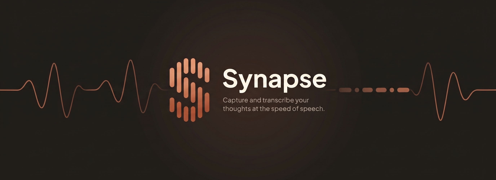

<p align="center">
  
</p>

<p align="center">
  
  
  
</p>

Synapse is a push-to-talk dictation app for Windows and macOS. Hold the shortcut, speak, release, and the text is pasted into the active window.

## Features

- **Local transcription.** Whisper runs on your machine, on the GPU when available, with automatic CPU fallback.
- **Groq option.** Send audio to the Groq API when speed matters more than staying offline.
- **AI correction and translation.** Optional pass that fixes grammar or translates the text. Works with a local model, Groq, or any OpenAI-compatible, Anthropic, or Ollama endpoint.
- **Dictionary and vocabulary.** Fixed replacements and custom terms for names and jargon.
- **History.** Every transcript is stored locally and searchable.

## Getting started

**Windows**

```powershell
scripts\windows\setup.bat
scripts\windows\run-dev.bat
```

`setup.bat` installs the toolchain (Visual Studio Build Tools, Rust, LLVM, CMake, Node.js, and optionally CUDA). `run-dev.bat` compiles and opens the app.

**macOS**

```bash
./scripts/macos/mac-setup.sh
./scripts/macos/run-dev.sh
```

Then open Settings from the widget, pick a model under **Voice**, and hold `Ctrl+Shift+Space` to dictate.

## Build

| Command | Output |
|---|---|
| `scripts\windows\build.bat` | Windows installer, NVIDIA GPU (requires the CUDA Toolkit) |
| `scripts\windows\build-cpu.bat` | Windows installer, CPU only |
| `./scripts/macos/build-dmg.sh` | macOS `.dmg`, Apple Silicon |

Output goes to `src-tauri/target/release/bundle/`.

## Data

| | Windows | macOS |
|---|---|---|
| Settings, models, history | `Documents\Synapse` | `~/Documents/Synapse` |
| Logs | `%LOCALAPPDATA%\com.synapse.voice\logs` | `~/Library/Application Support/com.synapse.voice/logs` |

Audio and text stay on your machine unless you choose Groq or a remote AI endpoint.

## License

MIT. See [LICENSE](LICENSE).
